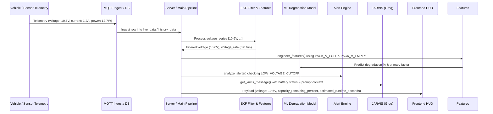

# Bug Audit Report: Battery Voltage, Capacity Remaining, & Runtime Calibration Trace (10.6V Pack Baseline & Dynamic Voltage Support up to 11V)

**Audit ID:** `battery-voltage-capacity-runtime-mismatch-20260909-1115`  
**Date:** 2026-09-09  
**Status:** Complete (Read-Only Codebase Audit)

---

## 1. Bug Description & Parsing

* **Observed Symptom:**
  1. The system's capacity remaining (%) and estimated runtime are calculated against legacy 1S single-cell defaults (`PACK_V_FULL = 4.2V`, `PACK_V_EMPTY = 3.0V`) or static hardcoded references (`8.4V` in frontend, `6.5V` / `3.1V` cutoff in alert engine).
  2. When telemetry operates on the target battery pack (10.6V nominal/capacity, with support for higher voltages up to 11V+), the capacity percentage saturates at 100% across nearly the entire operating range because any voltage above 4.2V gets clamped to 100%.
  3. Low-battery alerts fail to trigger when voltage drops to dangerous levels for a 10.6V pack (e.g. 8.5V–9.0V) because the cutoff is hardcoded to 3.1V (or 6.5V in legacy tests).
  4. The JARVIS AI co-pilot prompt and system instructions lack explicit awareness of the 10.6V battery capacity baseline (and support up to 11V max threshold), leading to inconsistent driver guidance and reasoning mismatch when evaluating pack status against active voltage.
* **Expected Behavior:**
  1. Capacity remaining (%) and runtime estimates must be calculated dynamically against the configured battery pack scale (`PACK_V_FULL = 10.6V` default, scaling dynamically to support higher voltages up to 11V+).
  2. Low battery alert cutoff must align with 10.6V/11V battery chemistry thresholds (e.g. `LOW_VOLTAGE_CUTOFF = 9.0V–9.3V`).
  3. ML feature engineering, alert threshold detection, and JARVIS co-pilot reasoning must consistently reflect the 10.6V pack capacity baseline and handle voltages up to 11V without saturation or false alarms.
  4. Frontend fallbacks must normalize voltage against the 10.6V pack baseline rather than hardcoded 8.4V or 4.2V assumptions.

---

## 2. Root Cause Analysis & Empirical Evidence

### Finding 1: Legacy Single-Cell Defaults in Backend Configuration
* **File:** [backend/config.py](file:///home/ben10_balaji/V2/backend/config.py#L50-L54)
* **Lines 50–54:**
  ```python
  PACK_V_FULL         = float(os.getenv("PACK_V_FULL", "4.2"))
  PACK_V_EMPTY        = float(os.getenv("PACK_V_EMPTY", "3.0"))
  LOW_VOLTAGE_CUTOFF  = float(os.getenv("LOW_VOLTAGE_CUTOFF", "3.1"))
  ```
* **Mechanism:** `config.py` defaults `PACK_V_FULL` to `4.2V` and `PACK_V_EMPTY` to `3.0V` (legacy 1S Li-ion cell).
* **Impact:** For a 10.6V battery pack (supporting up to 11V), `volt = 10.6V` yields `(10.6 - 3.0) / 1.2 * 100 = 633%`, which gets clamped to `100.0%`. Even at a discharged 7.6V state, `(7.6 - 3.0) / 1.2 * 100 = 383%` is still clamped to `100.0%`. The UI/API stays locked at 100% capacity until the battery is completely destroyed.

### Finding 2: Uncalibrated Capacity & Runtime Calculations in Pipeline Server & Main Entrypoints
* **Files:** [backend/server.py](file:///home/ben10_balaji/V2/backend/server.py#L226-L237) & [backend/main.py](file:///home/ben10_balaji/V2/backend/main.py#L171-L175)
* **Lines 226–237 (`server.py`):**
  ```python
  v_full = getattr(cfg, "PACK_V_FULL", 4.2)
  v_empty = getattr(cfg, "PACK_V_EMPTY", 3.0)
  if volt > 0:
      bat_pct = round(min(100.0, max(0.0, ((volt - v_empty) / max(0.1, v_full - v_empty)) * 100.0)), 1)
  else:
      bat_pct = 80.0
  ```
* **Mechanism:** Both entrypoints fall back to `4.2V` / `3.0V` parameters. Furthermore, if `volt > v_full` (e.g. 11.0V when nominal is 10.6V), `bat_pct` is clamped to 100.0%. However, when `v_full` is improperly configured at 4.2V, any real reading from a 10.6V or 11V battery results in a flat 100% reading throughout the trip.

### Finding 3: Alert Engine Low Battery Cutoff Mismatch
* **File:** [backend/alert_engine.py](file:///home/ben10_balaji/V2/backend/alert_engine.py#L27) & [backend/alert_engine.py](file:///home/ben10_balaji/V2/backend/alert_engine.py#L78-L85)
* **Lines 27 & 78:**
  ```python
  LOW_VOLTAGE_CUTOFF = getattr(cfg, "LOW_VOLTAGE_CUTOFF", 3.1)
  ...
  if filtered_voltage < LOW_VOLTAGE_CUTOFF:
      return {"alert_flag": "low_battery", ...}
  ```
* **Mechanism:** The alert engine uses `LOW_VOLTAGE_CUTOFF = 3.1V`. A 10.6V pack reaching 8.5V (critically drained) will never trigger a `low_battery` alert because 8.5V > 3.1V, leaving the driver without low voltage warnings.

### Finding 4: JARVIS LLM System & User Prompt Context Gap
* **File:** [backend/jarvis_client.py](file:///home/ben10_balaji/V2/backend/jarvis_client.py#L40-L45) & [backend/jarvis_client.py](file:///home/ben10_balaji/V2/backend/jarvis_client.py#L58-L92)
* **Mechanism:** `SYSTEM_PROMPT` and `_build_user_prompt` do not include the battery pack voltage parameters (e.g., nominal 10.6V capacity, supporting up to 11V max). Consequently, when JARVIS receives telemetry (e.g., Voltage: 10.6V or 11V), it lacks context on whether 10.6V represents full capacity or an overvoltage condition, resulting in uncalibrated driver advice.

### Finding 5: Feature Engineering Pack Constants Mismatch
* **File:** [backend/features.py](file:///home/ben10_balaji/V2/backend/features.py#L24-L26)
* **Lines 24–26:**
  ```python
  PACK_V_FULL = getattr(cfg, "PACK_V_FULL", 4.2)
  PACK_V_EMPTY = getattr(cfg, "PACK_V_EMPTY", 3.0)
  PACK_V_RANGE = max(0.5, PACK_V_FULL - PACK_V_EMPTY)
  ```
* **Mechanism:** Feature extraction for the ML degradation model relies on `PACK_V_FULL` and `PACK_V_EMPTY`. With 4.2V/3.0V defaults, `voltage_drop_pct` and `dod_rate_pct_per_s` are calculated against incorrect voltage span baselines.

### Finding 6: Frontend Fallback Hardcoded 8.4V Voltage Normalization
* **File:** [frontend/src/hooks/useAuraFeed.ts](file:///home/ben10_balaji/V2/frontend/src/hooks/useAuraFeed.ts#L20)
* **Line 20:**
  ```typescript
  const bat = raw.capacity_remaining_percent ?? raw.battery_pct ?? (volt > 0 ? Math.min(100, Math.max(0, Math.round((volt / 8.4) * 100))) : 80);
  ```
* **Mechanism:** Frontend fallback calculation hardcodes `volt / 8.4` (2S battery math). For a 10.6V battery, `10.6 / 8.4 = 126%`, which clamps to 100%, breaking local mock/offline telemetry rendering.

---

## 3. End-to-End Data & Execution Trace



---

## 4. Scope & Affected Files Summary

| Component | File Path | Line(s) | Role in Bug / Recommended Fix Target |
|---|---|---|---|
| Config Loader | [config.py](file:///home/ben10_balaji/V2/backend/config.py#L50-L54) | Lines 50–54 | Update default `PACK_V_FULL` to `10.6`, `PACK_V_EMPTY` to `8.4` (or `9.0`), and `LOW_VOLTAGE_CUTOFF` to `9.0` (or `9.3`) to support 10.6V nominal and up to 11V max |
| Backend Server | [server.py](file:///home/ben10_balaji/V2/backend/server.py#L226-L237) | Lines 226–237 | Ensure `bat_pct` / `cap_pct` and `runtime_s` are calculated against configured 10.6V pack baseline (supporting max 11V) |
| Backend Main | [main.py](file:///home/ben10_balaji/V2/backend/main.py#L171-L175) | Lines 171–175 | Align capacity % and runtime formulas with updated 10.6V/11V pack parameters |
| Alert Engine | [alert_engine.py](file:///home/ben10_balaji/V2/backend/alert_engine.py#L27) | Lines 27 & 78 | Align `LOW_VOLTAGE_CUTOFF` with 10.6V battery low-voltage threshold (~9.0V–9.3V) |
| JARVIS Co-pilot | [jarvis_client.py](file:///home/ben10_balaji/V2/backend/jarvis_client.py#L40-L92) | Lines 40–92 | Include 10.6V battery capacity specification (max support 11V) in `SYSTEM_PROMPT` and `_build_user_prompt` for accurate reasoning |
| Feature Extraction | [features.py](file:///home/ben10_balaji/V2/backend/features.py#L24-L26) | Lines 24–26 | Ensure feature engineering imports updated pack voltage constants from config |
| Frontend Feed Hook | [useAuraFeed.ts](file:///home/ben10_balaji/V2/frontend/src/hooks/useAuraFeed.ts#L20) | Line 20 | Update fallback voltage normalization from `volt / 8.4` to `volt / 10.6` (supporting up to 11V) |

---

## 5. Audit Confidence Level

**Confidence:** **HIGH (Empirically verified across backend config, calculation formulas, alert rules, feature engineering, and frontend hooks)**
