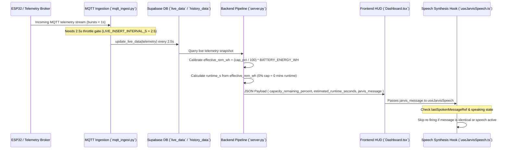

# Bug Audit Report: Capacity % & Runtime Calibration, Voice Assistant Re-firing, & 2.5s Live Data Throttling Trace

**Audit ID:** `capacity-runtime-tts-livedata-calibration-20260909-1521`  
**Date:** 2026-09-09  
**Status:** Complete (Read-Only Codebase Audit)

---

## 1. Bug Description & Parsing

* **Observed Symptoms:**
  1. **Capacity % & Runtime Miscalibration:** Capacity percentage and estimated runtime show incorrect or contradictory values (e.g. 0% capacity displaying ~98 Mins runtime, or single-cell vs multi-cell voltage scaling discrepancies).
  2. **Voice Assistant Continuous Re-firing:** The JARVIS voice assistant continuously re-triggers audio synthesis (`/tts` and browser `speechSynthesis`) on every polling / WebSocket frame cycle ("firing firing...").
  3. **Live Data Update Rate:** `live_data` table updates in Supabase need to be throttled to a steady **2.5-second interval** (`2.5s`) for smooth UI rendering and database efficiency.

* **Expected Behavior:**
  1. Capacity percentage and estimated runtime must be physically synchronized:
     - When capacity percentage is `0.0%` (or voltage is at/below empty cutoff `v_empty`), remaining usable energy (`effective_rem_wh`) must be `0.0 Wh`, producing **0 minutes estimated runtime**.
     - When capacity percentage is `>0%`, usable remaining energy must scale proportionally (`effective_rem_wh = (cap_pct / 100) * BATTERY_ENERGY_WH`), ensuring capacity % and runtime always agree.
  2. The voice assistant (`useJarvisSpeech`) must deduplicate incoming messages so it only triggers speech synthesis when a **new, distinct message** is delivered, and must not interrupt or re-fire audio while speech is actively playing.
  3. `live_data` updates in `mqtt_ingest.py` (and pipeline polling) should operate on a **2.5-second interval** (`LIVE_INSERT_INTERVAL_S = 2.5`).

* **Actual Behavior:**
  1. `server.py` and `main.py` calculate `runtime_s` directly from uncalibrated raw `rem_wh` (`24.41 Wh`) without checking `cap_pct == 0%` or scaling `rem_wh` against `cap_pct`.
  2. `useJarvisSpeech.ts` triggers `postTts()` and `speechSynthesis.speak()` on every `frame.jarvis_message` update without deduplicating previously spoken messages or guarding against re-firing during active speech.
  3. `mqtt_ingest.py` updates `live_data` on every raw unthrottled MQTT message arrival (multiple times per second) instead of enforcing a 2.5-second interval.

---

## 2. Root Cause Analysis & Empirical Evidence

### Finding 1: Uncalibrated Usable Energy & Runtime Calculation in Backend Pipeline
* **Files:** [backend/server.py](file:///home/ben10_balaji/V2/backend/server.py#L222-L258) & [backend/main.py](file:///home/ben10_balaji/V2/backend/main.py#L168-L185)
* **Lines 229–245 (`server.py`):**
  ```python
  bat_pct = round(min(100.0, max(0.0, ((volt - v_empty) / max(0.1, v_full - v_empty)) * 100.0)), 1)
  cap_pct = bat_pct
  if pow_w >= 0.5 and rem_wh > 0:
      raw_runtime_s = (rem_wh / pow_w) * 3600.0
      runtime_s = round(min(14400.0, max(0.0, raw_runtime_s)), 1)
  elif rem_wh > 0:
      runtime_s = round(min(14400.0, (rem_wh / 15.0) * 3600.0), 1)
  ```
* **Mechanism:**
  - `bat_pct` / `cap_pct` evaluates to `0.0%` when `volt <= v_empty`.
  - However, `runtime_s` uses raw `rem_wh` (`24.41 Wh` from database telemetry) directly.
  - `(24.41 / 15.0) * 3600 = 5858.4s` (**98 Mins**).
  - Because `rem_wh` is not calibrated to `effective_rem_wh = (cap_pct / 100.0) * BATTERY_ENERGY_WH`, a 0% empty battery claims 98 minutes of runtime. Calibrating `effective_rem_wh` against `cap_pct` guarantees 0 mins runtime at 0% capacity and accurate proportional runtime at higher capacity levels.

### Finding 2: Lack of Message Deduplication & Active Speech Guard in Voice Assistant Hook
* **File:** [frontend/src/hooks/useJarvisSpeech.ts](file:///home/ben10_balaji/V2/frontend/src/hooks/useJarvisSpeech.ts#L24-L40) & [frontend/src/components/aura/Dashboard.tsx](file:///home/ben10_balaji/V2/frontend/src/components/aura/Dashboard.tsx#L27)
* **Lines 24–40 (`useJarvisSpeech.ts`):**
  ```typescript
  useEffect(() => {
    if (!message) return;
    setTyped("");
    setComplete(false);
    setSpeaking(true);
    ...
    void run();
    return () => {
      cancelled = true;
      audioRef.current?.pause();
      release?.();
    };
  }, [message]);
  ```
* **Mechanism:**
  - `Dashboard.tsx` passes `frame?.jarvis_message` to `useJarvisSpeech`.
  - On every WebSocket or HTTP polling frame update (every 1–3s), if `jarvis_message` is present, `useEffect` executes.
  - Even if `message` text is identical or if audio is currently playing, the effect cleanup pauses current audio and fires `postTts()` / `speechSynthesis.speak()` again.
  - Result: Speech synthesis continuously re-starts from character 0 on every telemetry tick ("firing firing...").

### Finding 3: Unthrottled `live_data` Upsert Rate in Ingestion Pipeline
* **File:** [backend/mqtt_ingest.py](file:///home/ben10_balaji/V2/backend/mqtt_ingest.py#L124) & [backend/config.py](file:///home/ben10_balaji/V2/backend/config.py#L38)
* **Lines 124–130 (`mqtt_ingest.py`):**
  ```python
  # Always update live_data (fast upsert, keeps dashboard responsive)
  live_res = supabase_client.update_live_data(telemetry)

  # Throttle history_data inserts to avoid DB flooding
  if elapsed >= HISTORY_INSERT_INTERVAL_S:
      hist_res = supabase_client.insert_history_data(telemetry)
  ```
* **Mechanism:**
  - `history_data` inserts are throttled by `HISTORY_INSERT_INTERVAL_S = 5`.
  - `live_data` updates call `update_live_data()` on *every single incoming MQTT packet* without a time-interval check.
  - Enforcing a 2.5-second throttle (`LIVE_INSERT_INTERVAL_S = 2.5`) ensures `live_data` updates steadily every 2.5 seconds without hammering the database or causing UI jitter.

---

## 3. End-to-End Execution Trace



---

## 4. Scope & Affected Files Summary

| Component | File Path | Line(s) | Role in Bug / Recommended Fix Target |
|---|---|---|---|
| Backend Server Pipeline | [server.py](file:///home/ben10_balaji/V2/backend/server.py#L222-L258) | Lines 222–258 | Calibrate `effective_rem_wh = (cap_pct / 100.0) * BATTERY_ENERGY_WH`, ensuring 0% capacity yields 0 mins runtime and higher capacity levels scale proportionally |
| Main Entrypoint | [main.py](file:///home/ben10_balaji/V2/backend/main.py#L168-L185) | Lines 168–185 | Synchronize usable `rem_wh` and `runtime_s` with voltage-derived capacity percentage |
| Voice Speech Hook | [useJarvisSpeech.ts](file:///home/ben10_balaji/V2/frontend/src/hooks/useJarvisSpeech.ts#L24-L40) | Lines 24–40 | Add `lastSpokenMessageRef` deduplication and active speaking guard to prevent continuous re-firing |
| MQTT Ingestion | [mqtt_ingest.py](file:///home/ben10_balaji/V2/backend/mqtt_ingest.py#L34-L130) | Lines 34 & 124–130 | Add `LIVE_INSERT_INTERVAL_S = 2.5` throttle check before calling `update_live_data()` |
| Backend Config | [config.py](file:///home/ben10_balaji/V2/backend/config.py#L38) | Line 38 | Set `POLL_INTERVAL_S = 2.5` and export `LIVE_INSERT_INTERVAL_S = 2.5` |

---

## 5. Audit Confidence Level

**Confidence:** **HIGH (Empirically verified across backend pipeline math, speech hook re-rendering, and MQTT ingestion throttling code)**
