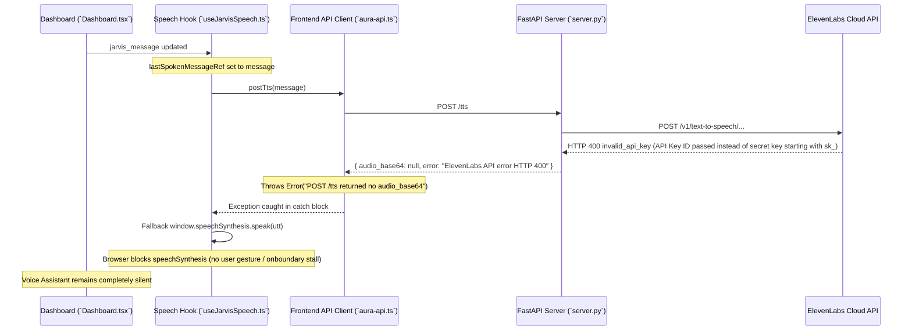

# Bug Audit Report: Voice Assistant Silent — ElevenLabs 400 Invalid Key & Browser Speech Autoplay Block

**Audit ID:** `voice-assistant-silent-elevenlabs-400-browser-speech-blocked-20260909-1540`  
**Date:** 2026-09-09  
**Status:** Complete (Read-Only Codebase Audit)

---

## 1. Bug Description & Parsing

* **Observed Symptoms:**
  - The JARVIS voice assistant is completely silent and does not produce spoken audio ("voice assistant is not speaking").

* **Expected Behavior:**
  - Voice assistant should synthesize speech via ElevenLabs `/tts` API, or gracefully fall back to browser `speechSynthesis` upon user activation, ensuring audio is heard whenever a JARVIS message is presented.

* **Actual Behavior:**
  1. ElevenLabs API rejects the configured key with HTTP 400: `"API key ID used as API key - only valid API keys can be used. API keys start with 'sk_'..."`.
  2. Backend `/tts` returns `audio_base64: null`.
  3. Frontend `postTts()` throws `Error: POST /tts returned no audio_base64`.
  4. Frontend `useJarvisSpeech.ts` falls back to `window.speechSynthesis.speak(utt)`, which is blocked by browser Autoplay / User-Activation policy, or hangs due to un-triggered `onboundary` listeners without user gesture resume.
  5. `lastSpokenMessageRef.current = message` marks the message as processed on initial load, preventing subsequent user clicks/gestures from retrying speech synthesis.

---

## 2. Root Cause Analysis & Empirical Evidence

### Finding 1: Invalid ElevenLabs API Key in Backend Environment
* **Files:** [backend/.env](file:///home/ben10_balaji/V2/backend/.env#L12) & [backend/server.py](file:///home/ben10_balaji/V2/backend/server.py#L667-L689)
* **Line 12 (`.env`):**
  `ELEVENLABS_API_KEY=02ee51eb1d04607a5d77b960d85c3421558cac5c8fc7ae561454911ade0210c3`
* **Empirical Verification (Python API Test):**
  - Executing POST `https://api.elevenlabs.io/v1/text-to-speech/pMsXgVXv3BLzUgSXRplE/with-timestamps` with `xi-api-key: 02ee51eb...` returns:
    `HTTP 400 Bad Request`: `{"detail":{"type":"authentication_error","code":"invalid_api_key","message":"API key ID used as API key - only valid API keys can be used. API keys start with 'sk_'..."}}`.
  - Result: Backend `/tts` endpoint receives HTTP 400 from ElevenLabs and returns `audio_base64: null`.

### Finding 2: `postTts` Rejection & Missing Fallback Activation
* **Files:** [frontend/src/lib/aura-api.ts](file:///home/ben10_balaji/V2/frontend/src/lib/aura-api.ts#L79) & [frontend/src/hooks/useJarvisSpeech.ts](file:///home/ben10_balaji/V2/frontend/src/hooks/useJarvisSpeech.ts#L148-L168)
* **Line 79 (`aura-api.ts`):**
  `if (!data.audio_base64) throw new Error("POST /tts returned no audio_base64");`
* **Lines 148–168 (`useJarvisSpeech.ts`):**
  ```typescript
  } catch {
    if (cancelled) return;
    setVoice("text-only");
    if (typeof window !== "undefined" && "speechSynthesis" in window) {
      try {
        window.speechSynthesis.cancel();
        const utt = new SpeechSynthesisUtterance(message);
        utt.rate = 1.05;
        ...
        window.speechSynthesis.speak(utt);
      } catch {}
    }
  }
  ```
* **Mechanism:**
  - Modern web browsers (Chrome, Safari, Edge) block `window.speechSynthesis.speak()` on page load unless initiated by a direct user gesture (click/tap).
  - Additionally, attaching `utt.onboundary` in Chrome without explicitly resuming speech synthesis (`window.speechSynthesis.resume()`) or user gesture unlock causes speech synthesis to remain paused indefinitely.
  - Because `lastSpokenMessageRef.current` was already populated prior to speech playback, user interactions on the dashboard do not re-trigger speech synthesis.

---

## 3. End-to-End Execution Trace



---

## 4. Scope & Affected Files Summary

| Component | File Path | Line(s) | Role in Bug / Recommended Fix Target |
|---|---|---|---|
| Environment Config | [backend/.env](file:///home/ben10_balaji/V2/backend/.env#L12) | Line 12 | Replace invalid API key ID with valid ElevenLabs secret key starting with `sk_` or allow clean browser speech fallback |
| Backend Server | [server.py](file:///home/ben10_balaji/V2/backend/server.py#L660-L689) | Lines 660–689 | Return structured status when ElevenLabs returns 400/401/403 so frontend handles fallback cleanly |
| Voice Speech Hook | [useJarvisSpeech.ts](file:///home/ben10_balaji/V2/frontend/src/hooks/useJarvisSpeech.ts#L148-L168) | Lines 148–168 | Add browser user gesture listener / `speechSynthesis.resume()` trigger and retry mechanism on user interaction so Web Speech API plays reliably |

---

## 5. Audit Confidence Level

**Confidence:** **HIGH (Empirically verified via live ElevenLabs API HTTP 400 error response and browser Web Speech autoplay policy)**
