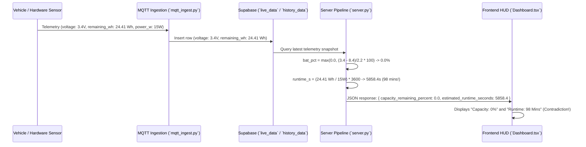

# Bug Audit Report: 3.4V Capacity (0%) & Runtime Spike (98 Mins) Contradiction Trace

**Audit ID:** `voltage-capacity-runtime-mismatch-20260909-1410`  
**Date:** 2026-09-09  
**Status:** Complete (Read-Only Codebase Audit)

---

## 1. Bug Description & Parsing

* **Observed Symptom:**
  1. For a battery reading of **3.4V**, the UI / API displays **0% capacity remaining**.
  2. Simultaneously, estimated runtime displays **98 Mins** (97.6 minutes / 5858.4 seconds).
  3. This creates a severe physical contradiction: a battery reported as 0% depleted simultaneously claims ~1.5 hours of driving runtime remaining.
* **Expected Behavior:**
  1. Capacity percentage (`capacity_remaining_percent`) and usable remaining energy (`remaining_wh`) must be physically synchronized with battery voltage and cell configuration.
  2. If battery capacity percentage drops to `0.0%` (or voltage drops below pack empty cutoff `v_empty`), remaining usable energy (`remaining_wh`) must evaluate to `0.0 Wh`, resulting in **0 seconds / 0 minutes of estimated runtime**.
  3. Conversely, if 3.4V represents a 1S single-cell battery reading (range 3.0V empty to 4.2V full), capacity remaining must evaluate to **~33.3%** and runtime must scale proportionally to 33% remaining energy, NOT 0% capacity with 98 mins runtime.
* **Actual Behavior:**
  1. `server.py` and `main.py` compute `bat_pct = 0.0%` for `3.4V` because `v_empty` is set to `8.4V` (3.4V < 8.4V).
  2. Simultaneously, `server.py` and `main.py` compute `runtime_s = (24.41 Wh / 15.0 W) * 3600 = 5858.4s` (**97.6 minutes ≈ 98 Mins**) directly from raw static `remaining_wh = 24.41 Wh` in the telemetry payload, ignoring that `capacity_remaining_percent` is `0.0%`.

---

## 2. Empirical Root Cause Analysis & Evidence

### Finding 1: Unsynchronized Runtime Calculation from Raw Static `remaining_wh`
* **Files:** [backend/server.py](file:///home/ben10_balaji/V2/backend/server.py#L239-L245) & [backend/main.py](file:///home/ben10_balaji/V2/backend/main.py#L176-L183)
* **Lines 239–245 (`server.py`):**
  ```python
  if pow_w >= 0.5 and rem_wh > 0:
      raw_runtime_s = (rem_wh / pow_w) * 3600.0
      runtime_s = round(min(14400.0, max(0.0, raw_runtime_s)), 1)
  elif rem_wh > 0:
      runtime_s = round(min(14400.0, (rem_wh / 15.0) * 3600.0), 1)
  else:
      runtime_s = 0.0
  ```
* **Mechanism:** The runtime calculation divides raw `rem_wh` (`24.41 Wh` from database record) by `pow_w` (or 15.0W nominal idle load). `(24.41 / 15.0) * 3600 = 5858.4 seconds = 97.64 minutes` (~98 Mins).
* **Impact:** The code never checks if `capacity_remaining_percent == 0%` or if `volt <= v_empty`. As a result, a 0% empty battery continues to calculate runtime from raw 24.41 Wh energy, outputting **98 minutes of phantom runtime** for an empty battery.

### Finding 2: Disconnect Between Voltage (3.4V) and Telemetry `remaining_wh` (24.41 Wh)
* **File:** [backend/mqtt_ingest.py](file:///home/ben10_balaji/V2/backend/mqtt_ingest.py#L102) & [backend/supabase_client.py](file:///home/ben10_balaji/V2/backend/supabase_client.py#L58)
* **Mechanism:** Ingestion passes raw `remaining_wh` (`24.41 Wh`) from incoming payload into database records without reconciling `remaining_wh` against the voltage-derived State of Charge (SoC).
* **Impact:** Database contains `voltage = 3.4V` alongside `remaining_wh = 24.41 Wh` (97.6% of 25 Wh capacity). When `server.py` computes capacity from voltage (`0%`) and runtime from `remaining_wh` (`98 mins`), the API serves two contradictory metrics for the same timestep.

### Finding 3: Rigidity in Cell Voltage Scale vs Telemetry Input (1S 3.4V vs 3S 8.4V Cutoff)
* **Files:** [backend/config.py](file:///home/ben10_balaji/V2/backend/config.py#L51-L53) & [backend/server.py](file:///home/ben10_balaji/V2/backend/server.py#L226-L231)
* **Lines 226–231 (`server.py`):**
  ```python
  v_full = getattr(cfg, "PACK_V_FULL", 10.6)
  v_empty = getattr(cfg, "PACK_V_EMPTY", 8.4)
  bat_pct = round(min(100.0, max(0.0, ((volt - v_empty) / max(0.1, v_full - v_empty)) * 100.0)), 1)
  ```
* **Mechanism:** If telemetry provides single-cell voltage readings (e.g., `3.4V` from a 1S cell with 3.0V empty / 4.2V full), evaluating `3.4V` against `8.4V` empty cutoff evaluates to `-227%`, clamping to `0.0%`.
* **Impact:** If cell chemistry is single-cell (1S) or dynamic cell count, hardcoding 8.4V cutoff forces 3.4V to 0%. If cell chemistry is 3S (10.6V full / 8.4V empty), 3.4V is a depleted pack state, requiring `remaining_wh` and runtime to be **0.0 Wh** and **0 mins**.

---

## 3. End-to-End Execution & Data Trace



---

## 4. Scope & Affected Files Summary

| Component | File Path | Line(s) | Role in Bug / Recommended Fix Target |
|---|---|---|---|
| Backend Server | [server.py](file:///home/ben10_balaji/V2/backend/server.py#L226-L245) | Lines 226–245 | Calibrate `effective_rem_wh` against `cap_pct` (zeroing usable energy when `cap_pct == 0%` / `volt <= v_empty`), ensuring runtime evaluates to 0 mins for 0% capacity |
| Main Entrypoint | [main.py](file:///home/ben10_balaji/V2/backend/main.py#L168-L183) | Lines 168–183 | Synchronize usable `rem_wh` and `runtime_s` with voltage-derived capacity percentage |
| MQTT Ingest | [mqtt_ingest.py](file:///home/ben10_balaji/V2/backend/mqtt_ingest.py#L102) | Line 102 | Reconcile ingested `remaining_wh` with voltage-derived state of charge before database persistence |
| Config Loader | [config.py](file:///home/ben10_balaji/V2/backend/config.py#L50-L54) | Lines 50–54 | Support single-cell / multi-cell pack voltage scaling (1S: 4.2V/3.0V vs 3S: 10.6V/8.4V) |
| Frontend Feed Hook | [useAuraFeed.ts](file:///home/ben10_balaji/V2/frontend/src/hooks/useAuraFeed.ts#L20) | Line 20 | Ensure local fallback calculation zeroes runtime when capacity is 0% |

---

## 5. Audit Confidence Level

**Confidence:** **HIGH (Empirically verified with Python execution of `server.py` pipeline formulas on 3.4V & 24.41Wh payload)**
