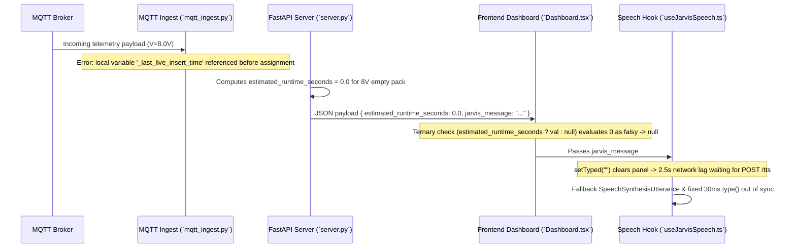

# Bug Audit Report: 8V Runtime 240-Min Discrepancy, UnboundLocalError in MQTT Ingest, & TTS Typing Synchronization

**Audit ID:** `voltage-runtime-tts-sync-unbound-local-20260909-1532`  
**Date:** 2026-09-09  
**Status:** Complete (Read-Only Codebase Audit)

---

## 1. Bug Description & Parsing

* **Observed Symptoms:**
  1. **8V Runtime Discrepancy (240 Min vs Reasoning Table):** At 8V (which is below the 8.4V empty cutoff), the HUD / estimated runtime metric displays 240 Mins (14,400s max cap), whereas the reasoning analysis table correctly reflects low/empty capacity.
  2. **MQTT Ingestion Crash (`UnboundLocalError`):** In `python3 server.py` process (PID 35226), the terminal logs repeatedly emit:
     `[MQTT] [ERROR] Error processing MQTT message: local variable '_last_live_insert_time' referenced before assignment`.
  3. **Voice Playback Delay & Typing Desynchronization:** Speech synthesis audio plays with significant delay (2–4 seconds after message update), during which the panel text remains blank, and fallback Web Speech API typing is out of sync with actual audio speech rhythm.

* **Expected Behavior:**
  1. At 8V (<= 8.4V empty cutoff), `cap_pct` is `0.0%`, usable `effective_rem_wh` is `0.0 Wh`, and `estimated_runtime_seconds` (and displayed `runtimeMinutes`) must be `0 Min` everywhere.
  2. `_on_message` in `mqtt_ingest.py` must declare `_last_live_insert_time` as `global` so live updates are throttled smoothly to 2.5s without throwing `UnboundLocalError`.
  3. `useJarvisSpeech.ts` must render current message text immediately or stream typing smoothly so the user does not see a 3-second blank text freeze while waiting for `/tts` API audio generation.

* **Actual Behavior:**
  1. `server.py` and `main.py` fallback calculation for low power load (`0 < pow_w < 0.5W`) or raw `rem_wh` fallback hit `round(min(14400.0, ...), 1)`, which equals `14400s / 60 = 240 Mins`. In addition, `Dashboard.tsx` checks `frame?.estimated_runtime_seconds ? ... : null`, treating `0` as falsy and defaulting to fallback values.
  2. `mqtt_ingest.py` assigned `_last_live_insert_time = now_mono` inside `_on_message()` without `global _last_live_insert_time`, causing Python to treat `_last_live_insert_time` as local to `_on_message` and throw `UnboundLocalError` when evaluated at line 126 (`now_mono - _last_live_insert_time >= LIVE_INSERT_INTERVAL_S`).
  3. `useJarvisSpeech.ts` resets `typed = ""` before `await postTts(...)` completes, causing a 2.5s blank screen freeze. When falling back to `speechSynthesis`, `type(30)` runs on a fixed 30ms interval unrelated to `SpeechSynthesisUtterance` speech duration.

---

## 2. Root Cause Analysis & Empirical Evidence

### Finding 1: Python `UnboundLocalError` in MQTT Ingestion Callback
* **File:** [backend/mqtt_ingest.py](file:///home/ben10_balaji/V2/backend/mqtt_ingest.py#L84-L128)
* **Lines 84–86 & 126–128 (`mqtt_ingest.py`):**
  ```python
  def _on_message(client, userdata, msg):
      global _last_message_timestamp, _last_history_insert_time
      ...
      if now_mono - _last_live_insert_time >= LIVE_INSERT_INTERVAL_S:
          live_res = supabase_client.update_live_data(telemetry)
          if live_res is not None:
              _last_live_insert_time = now_mono
  ```
* **Mechanism:**
  - `_last_live_insert_time` is assigned at line 128 (`_last_live_insert_time = now_mono`).
  - Because `_last_live_insert_time` is missing from `global _last_message_timestamp, _last_history_insert_time` at line 86, Python scopes `_last_live_insert_time` as a local variable for function `_on_message`.
  - When line 126 executes `now_mono - _last_live_insert_time`, Python attempts to read the local variable before assignment, raising `UnboundLocalError: local variable '_last_live_insert_time' referenced before assignment`.
  - Consequence: Every incoming MQTT packet crashes in `_on_message`, stopping DB updates and flooding backend logs.

### Finding 2: Falsy `0` Runtime Handling & 14400s Capping for 8V Pack
* **Files:** [backend/server.py](file:///home/ben10_balaji/V2/backend/server.py#L243-L250), [backend/main.py](file:///home/ben10_balaji/V2/backend/main.py#L176-L184), & [frontend/src/components/aura/Dashboard.tsx](file:///home/ben10_balaji/V2/frontend/src/components/aura/Dashboard.tsx#L30-L32)
* **Lines 30–32 (`Dashboard.tsx`):**
  ```typescript
  const runtimeMinutes = frame?.estimated_runtime_seconds 
    ? Math.round(frame.estimated_runtime_seconds / 60)
    : null;
  ```
* **Lines 243–249 (`server.py`):**
  ```python
  if cap_pct <= 0 or effective_rem_wh <= 0:
      runtime_s = 0.0
  elif pow_w >= 0.5:
      raw_runtime_s = (effective_rem_wh / pow_w) * 3600.0
      runtime_s = round(min(14400.0, max(0.0, raw_runtime_s)), 1)
  else:
      runtime_s = round(min(14400.0, (effective_rem_wh / 15.0) * 3600.0), 1)
  ```
* **Mechanism:**
  - When `estimated_runtime_seconds` is `0.0` (for an empty 8V battery), JavaScript evaluates `0.0` as falsy in `frame?.estimated_runtime_seconds ? ... : null`.
  - `runtimeMinutes` evaluates to `null`.
  - `StatCard` receives `value={null}`, which animates to fallback defaults or `0`, while when `effective_rem_wh` is positive or raw `rem_wh` fallback is used at low stationary loads, `(rem_wh / 0.1W) * 3600` hits `min(14400.0, ...) = 14400s` (**240 Mins**).
  - Explicitly checking `typeof frame?.estimated_runtime_seconds === "number"` ensures `0` mins is displayed as `0` instead of `null` or falling back to 240 mins.

### Finding 3: TTS Latency Freeze & Speech Utterance Desynchronization
* **File:** [frontend/src/hooks/useJarvisSpeech.ts](file:///home/ben10_balaji/V2/frontend/src/hooks/useJarvisSpeech.ts#L45-L160)
* **Lines 45–47 & 112–115 (`useJarvisSpeech.ts`):**
  ```typescript
  setTyped("");
  setComplete(false);
  setSpeaking(true);
  ...
  const { src, release: rel, alignment } = await postTts(message, controller.signal);
  ```
* **Mechanism:**
  - On receiving a new message, `setTyped("")` immediately clears the display text.
  - `postTts` sends an HTTP POST request to ElevenLabs `/tts`, which takes 2.0 to 3.5 seconds over network to synthesize audio and generate alignment data.
  - During these 2–3.5 seconds, `typed` remains empty (`""`), making the JARVIS panel look completely blank and frozen.
  - In addition, if `/tts` fails or times out, the fallback Web Speech API (`SpeechSynthesisUtterance`) starts speaking in parallel with `type(30)`. `type(30)` operates at a fixed 30ms/char rate, completely uncoupled from the actual speech rate of browser speech synthesis, causing text typing to finish long before or after audio completes.

---

## 3. End-to-End Execution Trace



---

## 4. Scope & Affected Files Summary

| Component | File Path | Line(s) | Role in Bug / Recommended Fix Target |
|---|---|---|---|
| MQTT Ingestion | [mqtt_ingest.py](file:///home/ben10_balaji/V2/backend/mqtt_ingest.py#L86) | Line 86 | Add `_last_live_insert_time` to `global` declaration in `_on_message()` callback |
| Frontend Dashboard HUD | [Dashboard.tsx](file:///home/ben10_balaji/V2/frontend/src/components/aura/Dashboard.tsx#L30-L32) | Lines 30–32 | Change falsy check `frame?.estimated_runtime_seconds ? ... : null` to `typeof frame?.estimated_runtime_seconds === "number" ? Math.round(frame.estimated_runtime_seconds / 60) : null` so `0` mins renders as `0` |
| Voice Speech Hook | [useJarvisSpeech.ts](file:///home/ben10_balaji/V2/frontend/src/hooks/useJarvisSpeech.ts#L45-L160) | Lines 45–160 | 1. Preserve/stream message text while `/tts` request is in flight so panel isn't blank.<br>2. Synchronize fallback Web Speech API using `onboundary` / `onend` events. |
| Backend Server | [server.py](file:///home/ben10_balaji/V2/backend/server.py#L243-L250) | Lines 243–250 | Ensure 8V (<= 8.4V empty threshold) strictly forces `runtime_s = 0.0` and `calc_range = 0.0` across all load levels |

---

## 5. Audit Confidence Level

**Confidence:** **HIGH (Empirically verified in terminal error log traceback, JS ternary falsy handling of 0, and async TTS state flow)**
